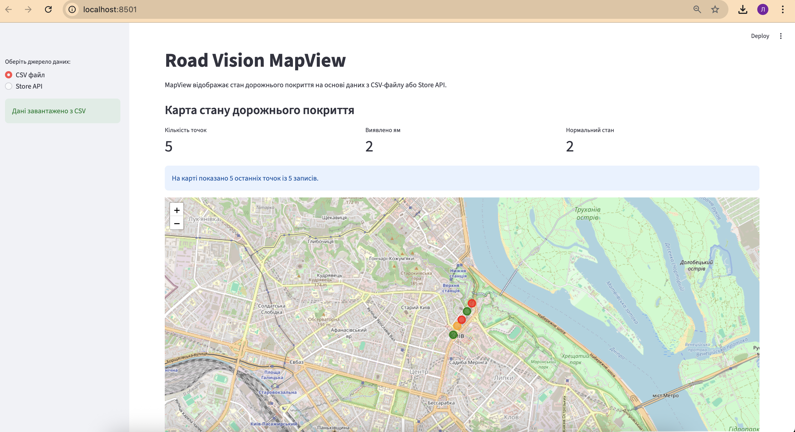
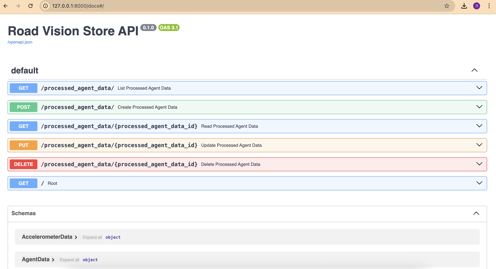
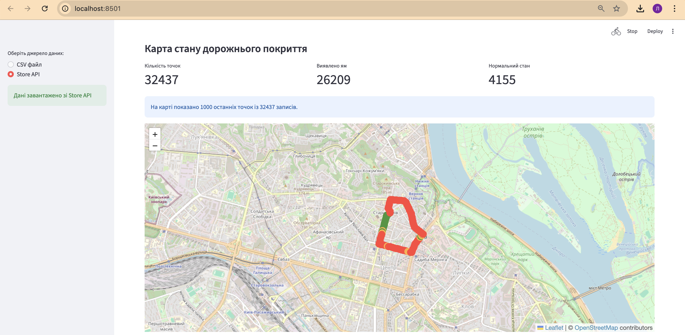

# IoT Lab 1.5

## Road Vision MapView

Інтерактивний вебзастосунок для візуалізації стану дорожнього покриття.

## Технології
- Python
- Streamlit
- PostgreSQL
- FastAPI
- Docker
- Folium

## Можливості
- Завантаження CSV
- Отримання даних через Store API
- Відображення карти
- Відображення статистики
- Таблиця дорожніх подій

## Запуск

```bash
docker compose up --build
```

Store API:
```text
http://localhost:8000/docs
```

MapView:
```text
http://localhost:8501
```
## Screenshots

### CSV Mode


### Store API Swagger


### Store API Map
